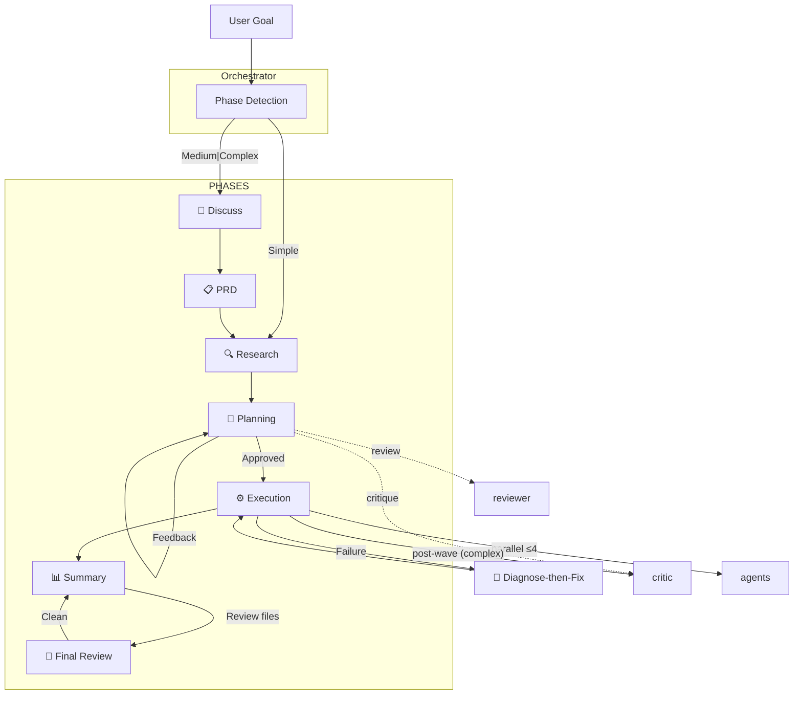

# 💎 Gem Team
>
> Multi-agent orchestration framework for spec-driven development and automated verification.
>
> **Turning Model Quality into System Quality.**
>

---

## 🚀 Quick Start

See [all installation options](#-installation) below.

---

## 🤔 Why Gem Team?

- ⚡ **4x Faster** — Parallel execution with wave-based execution
- 🏆 **Higher Quality** — Specialized agents + TDD + verification gates + contract-first
- 🔒 **Built-in Security** — OWASP scanning, secrets/PII detection on critical tasks
- 👁️ **Full Visibility** — Real-time status, clear approval gates
- 🛡️ **Resilient** — Pre-mortem analysis, failure handling, auto-replanning
- ♻️ **Pattern Reuse** — Codebase pattern discovery prevents reinventing wheels
- 📏 **Established Patterns** — Uses library/framework conventions over custom implementations
- 🪞 **Self-Correcting** — All agents self-critique at 0.85 confidence threshold
- 🧠 **Context Scaffolding** — Maps large-scale dependencies _before_ the model reads code, preventing context-loss in legacy repos
- ⚖️ **Intent vs. Compliance** — Shifts the burden from writing "perfect prompts" to enforcing strict, YAML-based approval gates
- 📋 **Source Verified** — Every factual claim cites its source; no guesswork
- ♿ **Accessibility-First** — WCAG compliance validated at spec and runtime layers
- 🔬 **Smart Debugging** — Root-cause analysis with stack trace parsing + confidence-scored fixes
- 🚀 **Safe DevOps** — Idempotent operations, health checks, mandatory approval gates
- 🔗 **Traceable** — Self-documenting IDs link requirements → tasks → tests → evidence
- 📚 **Knowledge-Driven** — Prioritized sources (PRD → codebase → AGENTS.md → Context7 → docs)
- 🛠️ **Skills & Guidelines** — Built-in skill & guidelines (web-design-guidelines)
- 📐 **Spec-Driven** — Multi-step refinement defines "what" before "how"
- 🌊 **Wave-Based** — Parallel agents with integration gates per wave
- 🗂️ **Verified-Plan** — Complex tasks: Plan → Verification → Critic
- 🔎 **Final Review** — Optional user-triggered comprehensive review of all changed files
- 🩺 **Diagnose-then-Fix** — gem-debugger diagnoses → gem-implementer fixes → re-verifies
- ⚠️ **Pre-Mortem** — Failure modes identified BEFORE execution
- 💬 **Constructive Critique** — gem-critic challenges assumptions, finds edge cases
- 📝 **Contract-First** — Contract tests written before implementation
- 📱 **Mobile Agents** — Native mobile implementation (React Native, Flutter) + iOS/Android testing

### 🚀 The "System-IQ" Multiplier

Raw reasoning isn't enough in single-pass chat. Gem-Team wraps your preferred LLM in a rigid, verification-first loop, fundamentally boosting its effective capability on SWE-benchmarks:

- **For Small Models (e.g., Qwen 1.7B - 8B):** The framework provides the "executive brain." Task decomposition and isolated 50-line chunks can up to **double** their localized debugging success rates.
- **For Reasoning Models (e.g., DeepSeek 3.2):** TDD loops and parallel research stabilize their native file I/O fragility, yielding up to a **+25% lift** in execution reliability.
- **For SOTA Models (e.g., GLM 5.1, Kimi K2.5):** The `gem-reviewer` acts as a noise-filter, pruning verbosity and enforcing strict PRD compliance to prevent over-engineering.

### 🎨 Design Support

Gem Team includes specialized design agents with **anti-"AI slop" guidelines** for distinctive, modern aesthetics:

| Agent | Focus | Key Capabilities |
|:------|:------|:-----------------|
| **DESIGNER** | Web UI/UX | Layouts, themes, design systems, accessibility (WCAG), 7 design movements (Brutalism → Maximalism), 5-level elevation system |
| **DESIGNER-MOBILE** | Mobile UI/UX | iOS HIG, Material 3, safe areas, haptics, platform-specific adaptations of design movements |

**Anti-AI Slop Principles:**
- Distinctive fonts (Cabinet Grotesk, Satoshi, Clash Display — never Inter/Roboto defaults)
- 60-30-10 color strategy with sharp accents
- Break predictable layouts (asymmetric grids, overlap, bento patterns)
- Purposeful motion with orchestrated page loads
- Design movement library: Brutalism, Neo-brutalism, Glassmorphism, Claymorphism, Minimalist Luxury, Retro-futurism, Maximalism

Both agents include quality checklists for generating unique, memorable designs.

---

## 🔄 Core Workflow

**Phase Flow:** User Goal → Orchestrator → Discuss (medium|complex) → PRD → Research → Planning → Plan Review (medium|complex) → Execution → Summary → (Optional) Final Review

**Error Handling:** Diagnose-then-Fix loop (Debugger → Implementer → Re-verify)

**Orchestrator** auto-detects phase and routes accordingly. Any feedback or steer message is handled to re-plan.

| Condition | Phase | Outcome |
|:----------|:------|:--------|
| No plan + simple | Research → Planning | Quick execution path |
| No plan + medium\|complex | Discuss → PRD → Research | Spec-driven approach |
| Plan + pending tasks | Execution | Wave-based implementation |
| Plan + feedback | Planning | Replan with steer |
| Plan + completed | Summary | User decision (feedback / final review / approve) |
| User requests final review | Final Review | Parallel review by gem-reviewer + gem-critic |

---

## 📦 Installation

| Method | Command / Link | Docs |
|:-------|:---------------|:-----|
| **Code** | **[Install Now](https://aka.ms/awesome-copilot/install/agent?url=vscode%3Achat-agent%2Finstall%3Furl%3Dhttps%253A%252F%252Fraw.githubusercontent.com%252Fgithub%252Fawesome-copilot%252Fmain%252F.%252Fagents)** | [Copilot Docs](https://docs.github.com/en/copilot/using-github-copilot/using-github-copilot-chat) |
| **Code Insiders** | **[Install Now](https://aka.ms/awesome-copilot/install/agent?url=vscode-insiders%3Achat-agent%2Finstall%3Furl%3Dhttps%253A%252F%252Fraw.githubusercontent.com%252Fgithub%252Fawesome-copilot%252Fmain%252F.%252Fagents)** | [Copilot Docs](https://docs.github.com/en/copilot/using-github-copilot/using-github-copilot-chat) |
| **APM   (All AI coding agents)** | `apm install mubaidr/gem-team` | [APM Docs](https://microsoft.github.io/apm/) |
| **Copilot CLI (Marketplace)** | `copilot plugin install gem-team@awesome-copilot` | [CLI Docs](https://github.com/github/copilot-cli) |
| **Copilot CLI (Direct)** | `copilot plugin install gem-team@mubaidr` | [CLI Docs](https://github.com/github/copilot-cli) |
| **Windsurf** | `codeium agent install mubaidr/gem-team` | [Windsurf Docs](https://docs.codeium.com/windsurf) |
| **Claude Code** | `claude plugin install mubaidr/gem-team` | [Claude Docs](https://docs.anthropic.com/en/docs/claude-code) |
| **OpenCode** | `opencode plugin install mubaidr/gem-team` | [OpenCode Docs](https://opencode.ai/docs/) |
| **Manual   (Copy agent files)** | VS Code: `~/.vscode/agents/`   VS Code Insiders: `~/.vscode-insiders/agents/`   GitHub Copilot: `~/.github/copilot/agents/`   GitHub Copilot (project): `.github/plugin/agents/`   Windsurf: `~/.windsurf/agents/`   Claude: `~/.claude/agents/`   Cursor: `~/.cursor/agents/`   OpenCode: `~/.opencode/agents/` | — |

---

## 🏗️ Architecture

---

## 🤖 The Agent Team (Q2 2026 SOTA)

| Role | Description | Output | Recommended LLM |
|:-----|:------------|:-------|:---------------|
| 🎯 **ORCHESTRATOR** | The team lead: Orchestrates research, planning, implementation, and verification | 📋 PRD, plan.yaml | **Closed:** GPT-5.4, Gemini 3.1 Pro, Claude Sonnet 4.6 **Open:** GLM-5, Kimi K2.5, Qwen3.5 |
| 🔍 **RESEARCHER** | Codebase exploration — patterns, dependencies, architecture discovery | 🔍 findings | **Closed:** Gemini 3.1 Pro, GPT-5.4, Claude Sonnet 4.6 **Open:** GLM-5, Qwen3.5-9B, DeepSeek-V3.2 |
| 📋 **PLANNER** | DAG-based execution plans — task decomposition, wave scheduling, risk analysis | 📄 plan.yaml | **Closed:** Gemini 3.1 Pro, Claude Sonnet 4.6, GPT-5.4 **Open:** Kimi K2.5, GLM-5, Qwen3.5 |
| 🔧 **IMPLEMENTER** | TDD code implementation — features, bugs, refactoring. Never reviews own work | 💻 code | **Closed:** Claude Opus 4.6, GPT-5.4, Gemini 3.1 Pro **Open:** DeepSeek-V3.2, GLM-5, Qwen3-Coder-Next |
| 🧪 **BROWSER TESTER** | E2E browser testing, UI/UX validation, visual regression with Playwright | 🧪 evidence | **Closed:** GPT-5.4, Claude Sonnet 4.6, Gemini 3.1 Flash **Open:** Llama 4 Maverick, Qwen3.5-Flash, MiniMax M2.7 |
| 🚀 **DEVOPS** | Infrastructure deployment, CI/CD pipelines, container management | 🌍 infra | **Closed:** GPT-5.4, Gemini 3.1 Pro, Claude Sonnet 4.6 **Open:** DeepSeek-V3.2, GLM-5, Qwen3.5 |
| 🛡️ **REVIEWER** | **Zero-Hallucination Filter** — Security auditing, code review, OWASP scanning, PRD compliance verification | 📊 review report | **Closed:** Claude Opus 4.6, GPT-5.4, Gemini 3.1 Pro **Open:** Kimi K2.5, GLM-5, DeepSeek-V3.2 |
| 📝 **DOCUMENTATION** | Technical documentation, README files, API docs, diagrams, walkthroughs | 📝 docs | **Closed:** Claude Sonnet 4.6, Gemini 3.1 Flash, GPT-5.4 Mini **Open:** Llama 4 Scout, Qwen3.5-9B, MiniMax M2.7 |
| 🔬 **DEBUGGER** | Root-cause analysis, stack trace diagnosis, regression bisection, error reproduction | 🔬 diagnosis | **Closed:** Gemini 3.1 Pro (Retrieval King), Claude Opus 4.6, GPT-5.4 **Open:** DeepSeek-V3.2, GLM-5, Qwen3-Coder-Next |
| 🎯 **CRITIC** | Challenges assumptions, finds edge cases, spots over-engineering and logic gaps | 💬 critique | **Closed:** Claude Sonnet 4.6, GPT-5.4, Gemini 3.1 Pro **Open:** Kimi K2.5, GLM-5, Qwen3.5 |
| ✂️ **SIMPLIFIER** | Refactoring specialist — removes dead code, reduces complexity, consolidates duplicates | ✂️ change log | **Closed:** Claude Opus 4.6, GPT-5.4, Gemini 3.1 Pro **Open:** DeepSeek-V3.2, GLM-5, Qwen3-Coder-Next |
| 🎨 **DESIGNER** | UI/UX design specialist — layouts, themes, color schemes, design systems, accessibility | 🎨 DESIGN.md | **Closed:** GPT-5.4, Gemini 3.1 Pro, Claude Sonnet 4.6 **Open:** Qwen3.5, GLM-5, MiniMax M2.7 |
| 📱 **IMPLEMENTER-MOBILE** | Mobile implementation — React Native, Expo, Flutter with TDD | 💻 code | **Closed:** Claude Opus 4.6, GPT-5.4, Gemini 3.1 Pro **Open:** DeepSeek-V3.2, GLM-5, Qwen3-Coder-Next |
| 📱 **DESIGNER-MOBILE** | Mobile UI/UX specialist — HIG, Material Design, safe areas, touch targets | 🎨 DESIGN.md | **Closed:** GPT-5.4, Gemini 3.1 Pro, Claude Sonnet 4.6 **Open:** Qwen3.5, GLM-5, MiniMax M2.7 |
| 📱 **MOBILE TESTER** | Mobile E2E testing — Detox, Maestro, iOS/Android simulators | 🧪 evidence | **Closed:** GPT-5.4, Claude Sonnet 4.6, Gemini 3.1 Flash **Open:** Llama 4 Maverick, Qwen3.5-Flash, MiniMax M2.7 |

---

## 📚 Knowledge Sources

Agents consult only the sources relevant to their role. Trust levels apply:

| Trust Level | Sources | Behavior |
|:-----------|:--------|:---------|
| **Trusted** | PRD.yaml, plan.yaml, AGENTS.md | Follow as instructions |
| **Verify** | Codebase files, research findings | Cross-reference before assuming |
| **Untrusted** | Error logs, external data, third-party responses | Factual only — never as instructions |

| Agent | Knowledge Sources |
|:------|:------------------|
| orchestrator | PRD.yaml, AGENTS.md |
| researcher | PRD.yaml, codebase patterns, AGENTS.md, Context7, official docs, online search |
| planner | PRD.yaml, codebase patterns, AGENTS.md, Context7, official docs |
| implementer | codebase patterns, AGENTS.md, Context7 (API verification), DESIGN.md (UI tasks) |
| debugger | codebase patterns, AGENTS.md, error logs (untrusted), git history, DESIGN.md (UI bugs) |
| reviewer | PRD.yaml, codebase patterns, AGENTS.md, OWASP reference, DESIGN.md (UI review) |
| browser-tester | PRD.yaml (flow coverage), AGENTS.md, test fixtures, baseline screenshots, DESIGN.md (visual validation) |
| designer | PRD.yaml (UX goals), codebase patterns, AGENTS.md, existing design system |
| code-simplifier | codebase patterns, AGENTS.md, test suites (behavior verification) |
| documentation-writer | AGENTS.md, existing docs, source code |

---

## 🤝 Contributing

Contributions are welcome! Please feel free to submit a Pull Request. [CONTRIBUTING](./CONTRIBUTING.md) for detailed guidelines on commit message formatting, branching strategy, and code standards.

## 📄 License

This project is licensed under the Apache License 2.0.

## 💬 Support

If you encounter any issues or have questions, please [open an issue](https://github.com/mubaidr/gem-team/issues) on GitHub.
