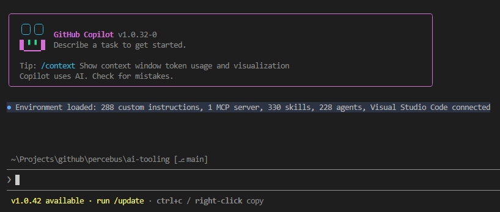

# AI tooling

What if we bring ALL the productivity AI tooling into 1 single place?

- `prompts`
- `agents`
- `instructions`
- `skills`
- `plugins`

## Resources

- [GitHub Copilot Customization Handbook](https://copilot-academy.github.io/workshops/copilot-customization/copilot_customization_handbook)
- [Finding and installing plugins for GitHub Copilot CLI](https://docs.github.com/en/copilot/how-tos/copilot-cli/customize-copilot/plugins-finding-installing)

### GitHub

- [`github`](https://github.com/github)
  - [`spec-kit`](https://github.com/github/spec-kit)
  - [`awesome-copilot`](https://github.com/github/awesome-copilot)
  - [`copilot-plugins`](https://github.com/github/copilot-plugins)
- [`microsoft`](https://github.com/microsoft)
  - [`hve-core`](https://github.com/microsoft/hve-core)
